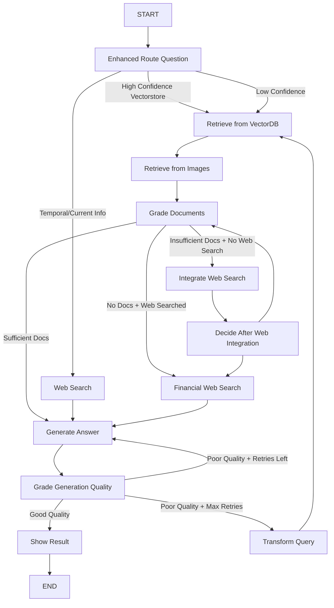

# Integrated LangGraph Workflow Documentation

## Overview

This document describes the enhanced LangGraph workflow that enables **integrated search** combining VectorDB (document retrieval) and Web search for comprehensive and accurate responses.

## Key Improvements

### 1. **Intelligent Routing**
- Enhanced routing logic that considers:
  - Vectorstore relevance scores and confidence levels
  - Question type analysis (temporal indicators, financial vs. general queries)
  - Multi-stage decision making

### 2. **Integrated Search Capability**
- **VectorDB First**: Always tries vectorstore retrieval first for company/financial questions
- **Web Supplementation**: Adds web search when vectorstore results are insufficient
- **Fallback Strategy**: Uses web search for temporal/current information needs

### 3. **Quality Assessment**
- Evaluates vectorstore result quality
- Determines when web search integration is needed
- Tracks search states to avoid infinite loops

## Workflow Architecture

### State Management
```python
class GraphState(TypedDict):
    messages: Annotated[Sequence[BaseMessage], add_messages]
    Intermediate_message: str
    documents: List[str]
    retry_count: int
    tool_calls: List[Dict[str, Any]]
    vectorstore_searched: bool      # NEW: Track if vectorstore was searched
    web_searched: bool             # NEW: Track if web search was performed  
    vectorstore_quality: str       # NEW: "good", "poor", "none"
    needs_web_fallback: bool       # NEW: Whether web search is needed
```

### New Nodes Added

#### 1. `integrate_web_search`
- Performs web search to supplement insufficient vectorstore results
- Combines web results with existing documents
- Updates search state tracking

#### 2. `evaluate_vectorstore_quality` 
- Assesses quality of vectorstore retrieval results
- Determines if web search supplementation is needed
- Uses document count and relevance heuristics

### Enhanced Nodes

#### 1. `route_question` (Enhanced)
- **Intelligent Multi-Factor Routing**:
  - Calculates relevance scores from vectorstore
  - Analyzes question for temporal indicators
  - Uses confidence thresholds for routing decisions

```python
# Routing Logic:
if vectorstore_confidence >= 3 and total_relevance > 0.7:
    return "vectorstore"  # High confidence
elif vectorstore_confidence >= 1 and total_relevance > 0.5:
    return "vectorstore"  # May need web supplement
else:
    # Check for temporal indicators
    web_indicators = ["current", "latest", "recent", "news", "today"]
    if any(indicator in question.lower() for indicator in web_indicators):
        return "web_search"
    else:
        return "vectorstore"  # Try vectorstore first, may integrate web
```

#### 2. `decide_to_generate` (Enhanced)
- **Multi-Source Decision Logic**:
  - Considers both vectorstore and web search states
  - Determines when to integrate web search
  - Provides fallback strategies

```python
# Decision Logic:
if not filtered_documents:
    if not web_searched and vectorstore_searched:
        return "integrate_web_search"  # Try web supplement
    else:
        return "financial_web_search"  # Final fallback
else:
    if vectorstore_searched and not web_searched and len(filtered_documents) < 3:
        return "integrate_web_search"  # Supplement with web
    else:
        return "generate"  # Sufficient documents
```

### Workflow Flow



## Integration Benefits

### 1. **Comprehensive Coverage**
- **Financial/Historical Data**: Retrieved from vectorstore (10-K reports, financial statements)
- **Current Information**: Retrieved from web search (recent news, market data)
- **Combined Analysis**: Synthesizes both sources for complete answers

### 2. **Intelligent Fallback Strategy**
```
1. Try VectorDB first (for most queries)
2. If insufficient results → Add Web Search
3. If still insufficient → Use Financial Web Search
4. If poor generation quality → Transform query and retry
```

### 3. **Quality Assurance**
- **Hallucination Detection**: Ensures generated answers are grounded in sources
- **Answer Quality Assessment**: Verifies answers address the user's question
- **Retry Logic**: Attempts to improve answers through query transformation

### 4. **Source Attribution**
- Tracks which tools were used for each response
- Enhanced RAG prompt handles multiple source types
- Clear indication of information sources in responses

## Example Scenarios

### Scenario 1: Company Financial Question
**Question**: "What is Tesla's revenue growth over the last 3 years?"

**Flow**:
1. `route_question` → High confidence for vectorstore
2. `retrieve` → Gets Tesla financial documents
3. `grade_documents` → Good quality documents found
4. `generate` → Creates comprehensive answer from 10-K data

### Scenario 2: Current Market Question  
**Question**: "What is Tesla's current stock price?"

**Flow**:
1. `route_question` → Detects temporal indicator "current"
2. `web_search` → Gets real-time market data
3. `generate` → Provides current information

### Scenario 3: Complex Integrated Question
**Question**: "How has Pfizer's R&D changed and what are recent developments?"

**Flow**:
1. `route_question` → Moderate confidence for vectorstore
2. `retrieve` → Gets historical R&D data from documents
3. `grade_documents` → Limited but relevant documents
4. `integrate_web_search` → Adds recent R&D news
5. `grade_documents` → Now has comprehensive information
6. `generate` → Synthesizes historical + current information

## Configuration Options

### Quality Thresholds
```python
# In decide_to_generate():
MIN_DOCS_FOR_WEB_SUPPLEMENT = 3  # Trigger web search if fewer docs
MAX_RETRIES = 2                  # Maximum generation retries

# In route_question():
HIGH_CONFIDENCE_THRESHOLD = 0.7   # Direct to vectorstore
MODERATE_CONFIDENCE_THRESHOLD = 0.5  # Try vectorstore first
MIN_VECTORSTORE_DOCS = 3         # Minimum docs for high confidence
```

### Search Behavior
- **Web Search Results**: 3 documents per search
- **VectorDB Results**: 4 documents per retrieval (text + images)
- **Retry Strategy**: Transform query after poor quality generation

## Monitoring and Debugging

### Tool Call Tracking
Every node adds entries to `tool_calls` state:
```python
tool_call_entry = {
    "tool": "node_name"
}
state["tool_calls"].append(tool_call_entry)
```

### State Tracking
Monitor search states:
- `vectorstore_searched`: Has vectorstore been queried?
- `web_searched`: Has web search been performed?
- `vectorstore_quality`: Quality assessment of vectorstore results
- `needs_web_fallback`: Should web search be integrated?

## Best Practices

1. **Question Analysis**: The system works best when questions are clear and specific
2. **Source Verification**: Always check `tool_calls` to understand which sources were used
3. **Quality Monitoring**: Monitor generation quality and retry patterns
4. **Threshold Tuning**: Adjust confidence thresholds based on your data quality

## Future Enhancements

1. **Machine Learning Quality Assessment**: Replace heuristic quality evaluation with ML models
2. **Dynamic Source Weighting**: Adjust source priority based on question type
3. **Caching Strategy**: Cache frequent query results for better performance
4. **Advanced Retry Logic**: More sophisticated query transformation strategies